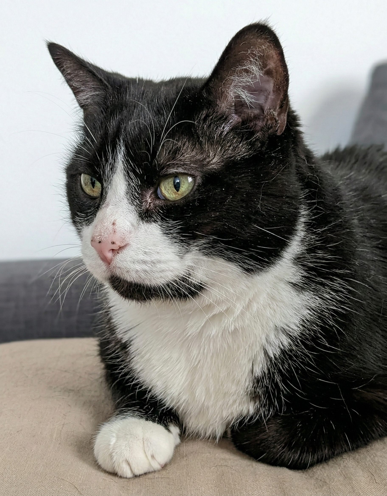

# 🐾 CV de Michi: Especialista en Silencio & Inquilino Senior
### _"Buscando un hogar donde mimetizarme con el sofá"_

  

---

## 🏢 ¿Qué es esto humano?

Bienvenidos al repositorio privado de **Michi**. Soy un felino de 5 años, castrado, asegurado hasta los bigotes y con un humano (mi mayordomo personal) que goza de un contrato indefinido asombrosamente estable.

Este repositorio contiene **mi majestuoso Currículum Vitae interactivo**. Mi objetivo es encantar a caseros, propietarios e inmobiliarias de Málaga para demostrarles empíricamente que soy una inversión inmobiliaria mucho más segura que un cachorro destrozamuebles.

> *"Mientras otros ladran al cartero, yo fiscalizo el grosor de las motas de polvo que flotan en el rayo de sol."* — Michi, 2026.

---

## 🎨 La Galería del Delirio (41 Modelos Alternativos)

¿Creías que iba a postular a un piso de alquiler con un aburrido PDF? Te equivocas. Mi currículum es un *framework-agnostic-responsive-experience*. 

Gracias a mis esclavos cibernéticos, tengo **41 variaciones de diseño diferentes** de mi CV. Desde la sobriedad del Neumorfismo hasta locuras absolutas que te derretirán las retinas.

🔹 **Puedes ver mi galería completa entrando aquí:** 
👉 `/Modelos_Alternativos/index.html`

### 🛠️ ¿Cómo funciona mi "Fotoestudio Automático"?

Tengo mi propio script de Node.js (`Modelos_Alternativos/generate_thumbnails.js`) que funciona como mi fotógrafo personal:
1. Me meto en la caja (creo o descargo un nuevo modelo HTML).
2. Mi humano presiona `update_thumbnails.bat`.
3. Un navegador sin cabeza (Puppeteer) sobrevuela mis **41 currículums**.
4. ¡Flash, flash! Les toma fotografías HD a todos y actualiza automáticamente mi vitrina de exhibición (`index.html`).

## 💼 Mis Habilidades Destacadas

| Habilidad | Nivel | Descripción Práctica para el Casero |
| :--- | :---: | :--- |
| **Sigilo Táctico** | 🥷 Nivel Ninja | Experto en caminar por la casa a las 3 AM sin producir más de 2 decibelios. |
| **Cero-Arañazos** | 🛋️ Nivel Dios | Conservo todos los muebles intactos. Uso exclusivamente mis rascadores carísimos. |
| **Precisión Láser** | 🎯 100% | Tasa de acierto del 100% en el arenero. No se ha fallado un tiro desde 2021. |
| **Modo Ahorro de Batería** | 💤 Nivel Perezoso | Capacidad para dormir hasta 16 horas seguidas en modo "stand-by". |

## 🚀 ¿Cómo desplegar mi grandeza en local?

Si eres un humano con conocimientos básicos de teclear:
1. **Clona** este repositorio (o dale al botón gordo verde).
2. Abre `index.html` (el principal) o métete a curiosear a `/Modelos_Alternativos/index.html`.
3. Contémplame en toda mi gloria y llámame para firmar ese contrato de arrendamiento.

---

<i>Creado con 🐾 y mucho atún. No me acaricien la panza, es una trampa.</i>

